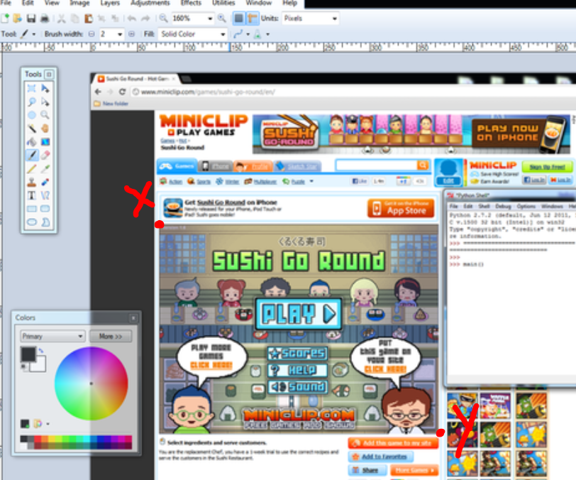
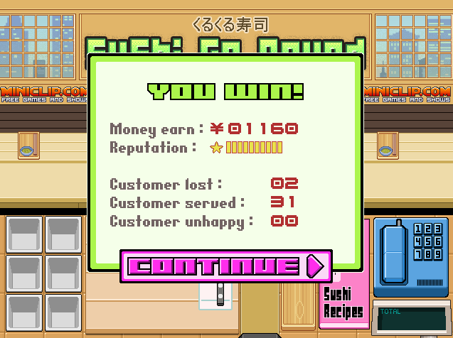

# sushibot
This is my sushibot and all the problems along the way

## Requirements

* Python 3.6 32-bit
* Pycharm 3.6 32-bit
* Libraries needed: `The Python Imaging Library (Pillow)`, `Numpy`, and `pypiwin32`
* Paint program like paint.net

## Setup for 1600 x 900 users

* Open the game (https://www.miniclip.com/games/sushi-go-round/en/) and fullscreen your screen. The corner must be to the right hand. You may need to adjust coordinates. 
* You can check if your mouse lines up with the game coordinates by running quickgrab.py

## Setup for other users
* Open the game (https://www.miniclip.com/games/sushi-go-round/en/) and fullscreen your screen.
* use quickgrab.py to take a picture of your full screen and then go on paint.net to get the coordinates of the game. Make sure your only capturing the game.
* place the new coordinates in line 28, 29 (x_pad, y_pad). More info lines 1-12

# Features
* starts the game/skips menu: startGame()
* refills ingredients
* makes sushi
* wins the first round
* clears tables

# Details
* Screen Resolution: 1600 x 900 
* Processor: Intel Core i5 @ 2.90 Ghz
* System type: 64-bit operating system. x64-based processor
* Windows 10 Pro

## Run game

def main():
    
    startGame()
     while True:
        check_bubs()
## Have fun

